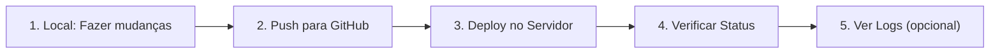

# 🚀 Quick Start - Deployment Automático

## 📌 TL;DR (Resumido)

### 1️⃣ Push para GitHub (Local)
```bash
bash push-github.sh
```
✅ Faz git add, commit e push automaticamente

### 2️⃣ Deploy no Servidor
```bash
ssh -i chave.key ubuntu@132.145.57.133 'cd ~/soma-automation/SOMA && bash deploy-server.sh'
```
✅ Git reset, pull, npm install, pm2 restart

### 3️⃣ Controlar via PM2 (Servidor)
```bash
ssh -i chave.key ubuntu@132.145.57.133 'bash ~/soma-automation/SOMA/control-soma.sh status'
```
✅ Ver status, logs, reiniciar processos

### 4️⃣ Rodar Local (Windows PowerShell)
```powershell
powershell -ExecutionPolicy Bypass -File deploy-local.ps1
```
✅ Ativa venv e roda python main.py

---

## 📚 Scripts Disponíveis

### 🔼 `push-github.sh` (Local)
Automatiza: git status → add → commit → push

**Uso:**
```bash
bash push-github.sh
```

**Interativo:**
- Mostra status dos ficheiros
- Pede confirmação para adicionar
- Pede mensagem de commit
- Faz push automático

**Exemplo:**
```
📊 Status dos ficheiros:
 M  src/file.py
 ?? newfile.txt

Adicionar TODAS as alterações? (s/n) s

✅ Ficheiros staged:
   src/file.py
   newfile.txt

Mensagem de commit: Fix: update logic

📦 Criando commit...
🚀 Enviando para GitHub...

================================================
✅ PUSH CONCLUÍDO!
```

---

### 🚀 `deploy-server.sh` (Servidor Ubuntu)
Automatiza: git reset → pull → npm install → pm2 restart

**Uso:**
```bash
# Via SSH
ssh -i chave.key ubuntu@132.145.57.133 'bash ~/soma-automation/SOMA/deploy-server.sh'

# Ou direto no servidor
cd ~/soma-automation/SOMA
bash deploy-server.sh
```

**O que faz:**
1. Git reset --hard (descarta mudanças locais)
2. Git pull (tira atualizações)
3. npm install (atualiza Node.js deps)
4. pip install (atualiza Python deps)
5. pm2 restart (reinicia processo)
6. Mostra status e logs

**Exemplo:**
```
================================================
DEPLOYMENT NO SERVIDOR - SOMA
================================================

🔄 [1/5] Sincronizando com GitHub...
   ✅ Git sincronizado

📦 [2/5] Atualizando dependências Node.js...
   ✅ Node.js dependências instaladas

🔄 [3/5] Reiniciando processos PM2...
   ✅ bot-igreja reiniciado

📊 [4/5] Verificando status...
...

================================================
✅ DEPLOYMENT CONCLUÍDO!
```

---

### 🎮 `control-soma.sh` (Servidor PM2)
Controla: status, start, stop, restart, logs, monit

**Uso:**
```bash
ssh -i chave.key ubuntu@132.145.57.133 'bash ~/soma-automation/SOMA/control-soma.sh <comando>'
```

**Comandos:**

| Comando | O que faz | Exemplo |
|---------|-----------|---------|
| `status` | Ver status | `control-soma.sh status` |
| `start` | Iniciar | `control-soma.sh start` |
| `stop` | Parar | `control-soma.sh stop` |
| `restart` | Reiniciar | `control-soma.sh restart` |
| `logs` | Últimas 30 linhas | `control-soma.sh logs` |
| `logs-f` | Logs em tempo real | `control-soma.sh logs-f` |
| `monit` | Dashboard | `control-soma.sh monit` |
| `health` | Verificação completa | `control-soma.sh health` |

**Exemplos:**
```bash
# Ver status
ssh -i chave.key ubuntu@132.145.57.133 'bash ~/soma-automation/SOMA/control-soma.sh status'

# Ver logs em tempo real
ssh -i chave.key ubuntu@132.145.57.133 'bash ~/soma-automation/SOMA/control-soma.sh logs-f'

# Restart
ssh -i chave.key ubuntu@132.145.57.133 'bash ~/soma-automation/SOMA/control-soma.sh restart'
```

---

### 💻 `deploy-local.ps1` (Windows PowerShell)
Ativa venv e roda orquestrador

**Uso:**
```powershell
# Rodar orquestrador
powershell -ExecutionPolicy Bypass -File deploy-local.ps1

# Ver status PM2
powershell -ExecutionPolicy Bypass -File deploy-local.ps1 -Status

# Parar processo
powershell -ExecutionPolicy Bypass -File deploy-local.ps1 -Stop

# Monitorar
powershell -ExecutionPolicy Bypass -File deploy-local.ps1 -Monitor
```

**Flags:**
- Sem flag: Roda `python main.py`
- `-Status`: Mostra status do PM2
- `-Stop`: Para o orquestrador
- `-Monitor`: Abre dashboard pm2 monit

---

## 🔄 Fluxo Completo de Deployment



### Passo a Passo:

**1️⃣ Local (Você fez mudanças no código)**
```bash
# Seu projeto local
cd C:\workspace\SOMA

# Fazer push (vai pedir mensagem)
bash push-github.sh
```

**2️⃣ Servidor (Sincronizar com GitHub)**
```bash
# SSH para o servidor
ssh -i chave.key ubuntu@132.145.57.133

# Deploy automático
cd ~/soma-automation/SOMA
bash deploy-server.sh
```

**3️⃣ Verificar (Confirmar que está funcionando)**
```bash
# Ver status
bash control-soma.sh status

# Ver logs
bash control-soma.sh logs

# Monitor em tempo real
bash control-soma.sh monit
```

---

## ⚡ Comandos Mais Usados

```bash
# 1. Push rápido
bash push-github.sh

# 2. Deploy rápido (via SSH)
ssh -i chave.key ubuntu@132.145.57.133 'cd ~/soma-automation/SOMA && bash deploy-server.sh'

# 3. Ver logs
ssh -i chave.key ubuntu@132.145.57.133 'bash ~/soma-automation/SOMA/control-soma.sh logs'

# 4. Restart rápido
ssh -i chave.key ubuntu@132.145.57.133 'bash ~/soma-automation/SOMA/control-soma.sh restart'

# 5. Health check
ssh -i chave.key ubuntu@132.145.57.133 'bash ~/soma-automation/SOMA/control-soma.sh health'
```

---

## 🔌 Criar Aliases (Opcional)

No Windows PowerShell (`$PROFILE`):
```powershell
# Add to $PROFILE

# Deploy
function deploy-github { bash push-github.sh }
function deploy-server { ssh -i C:\workspace\SOMA\chave.key ubuntu@132.145.57.133 'cd ~/soma-automation/SOMA && bash deploy-server.sh' }
function soma-status { ssh -i C:\workspace\SOMA\chave.key ubuntu@132.145.57.133 'bash ~/soma-automation/SOMA/control-soma.sh status' }
function soma-logs { ssh -i C:\workspace\SOMA\chave.key ubuntu@132.145.57.133 'bash ~/soma-automation/SOMA/control-soma.sh logs' }
function soma-restart { ssh -i C:\workspace\SOMA\chave.key ubuntu@132.145.57.133 'bash ~/soma-automation/SOMA/control-soma.sh restart' }
```

Depois: `deploy-github`, `deploy-server`, `soma-status`, etc.

---

## ✅ Resumo dos Benefícios

| Antes | Depois |
|--------|--------|
| 🐌 Digitava 15-20 comandos | ⚡ 1-2 comandos |
| ❌ Risco de erros | ✅ Automático |
| 📋 Difícil lembrar passos | 📚 Documentado |
| ⏱️ 5-10 minutos | ⏱️ 30 segundos |

---

**Status:** 🟢 Scripts prontos e testados
